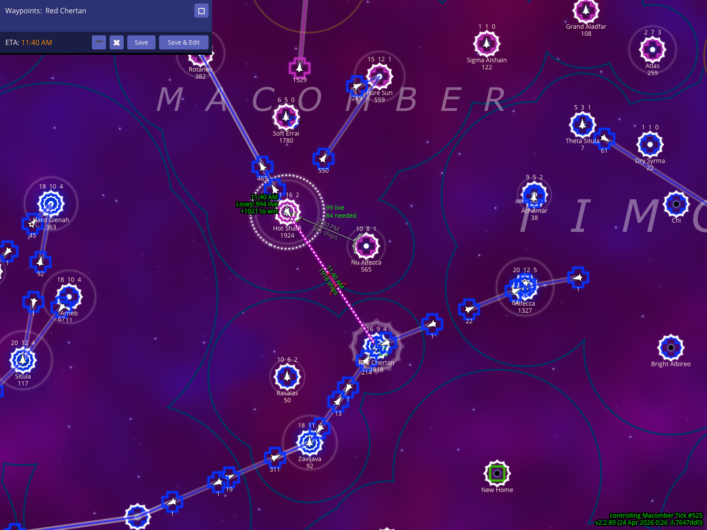
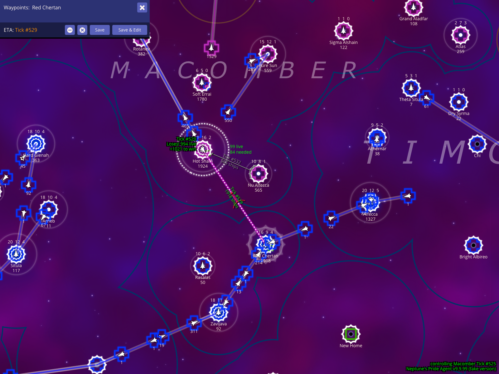

# How To Read The Battle HUD

The battle HUD is not one isolated panel. It is a set of map overlays, ETA labels, and control shortcuts that help you inspect a frontline star, plan enemy movement, and model worst-case combat assumptions.

## Create a fake enemy fleet from the selected frontline star

To plan for incoming attacks, you can create "synthetic" fleets to model enemy movement. Select an enemy star (such as `Hot Sham` in the example below) and press **x** to create a fake enemy fleet. NPA temporarily switches your planning context to that empire so you can plot routes and see exactly when they might arrive at your stars without changing the real game state.

### How to use it
- Select the enemy star you want to inspect.
- Press **x** to create a fake planning fleet from that star.
- Add waypoints to nearby stars (like `Red Chertan` in the example) to see potential travel times.

### What to expect
- As shown in the screenshot, the route line runs from the selected star toward your waypoints.
- The map overlay indicates you are temporarily controlling the selected enemy empire for planning.
- The waypoint editor displays an ETA using your currently selected timebase.

### Caveats
- Use these fake routes to identify the exact moment an enemy fleet could reach your territory. These orders are for local planning only and do not affect the live game.

## Show the battle ETA as clock time

NPA allows you to view ETAs in three different formats. Press **%** to cycle through these modes. Each serves a different tactical purpose: Clock Time (for personal alarms), Relative Ticks (for comparing speeds), and Absolute Ticks (for coordinating with allies).

### How to use it
- With a fleet route visible, press **%** once to switch to clock-time mode.
- Read the ETA line in the waypoint editor as a real-world time.

### What to expect
- Clock mode shows a real-world timestamp such as `11:40 AM`.
- The selected fake fleet and route stay in the same map frame while the ETA display changes.

### Caveats
- Use clock mode for your own alarms. Allies in other timezones should usually coordinate by tick number instead.

## Show the battle ETA as relative ticks

Relative ticks are best when you are comparing your selected fleet against other moving fleets on the map, because tick offsets are easier to compare than the game's default real-time display.

### How to use it
- After clock-time mode is visible, press **%** one more time.
- Read the ETA and production readouts as relative tick counts.

### What to expect
- Relative tick mode changes the ETA into a duration such as `4 ticks`.
- The waypoint panel, production readout, and route stay aligned with the chosen timebase.

## Show the same battle ETA as absolute tick numbers

Absolute tick numbers are the best timebase for ally coordination because everyone sees the same tick even when their local clock time differs.

### How to use it
- After reaching relative tick mode, press **%** one more time.
- Read the ETA and production readouts as explicit tick numbers (e.g., `Tick #529`).

### What to expect
- As seen in the example, the same route now shows an exact destination tick.
- You can compare the fleet ETA directly against combat or production timing discussed in reports and chat.

## Model a worst-case fight by giving the enemy extra weapons

You can manually adjust the weapons technology assumptions for a fight to see if your defense holds up against a more advanced enemy. Press **.** to add a weapons level to the side NPA is currently treating as the opponent.

### How to use it
- With a battle route selected, press **.** to increase the enemy weapons assumption by one level.

### What to expect
- The footer overlay changes to show the adjustment, for example `Enemy WS+1`.
- The projected survivor estimates update immediately to reflect the harsher combat assumption.

### Caveats
- Always test your critical defenses against `Enemy WS+1`. If you still win the fight under that assumption, your star is likely secure even if the enemy receives a technology gift from an ally.
- This is a planning aid. It changes NPA's local calculation, not the real weapons tech on the server.

## Return to the regular weapons calculation

Press **,** to remove weapons adjustments and return the battle HUD to the regular calculation. This gives you a visual checkpoint for the baseline survivor estimate before trying the opposite assumption.

### How to use it
- Start from the `Enemy WS+1` view.
- Press **,** once to step the weapons adjustment back to zero.

### What to expect
- The footer no longer shows an adjustment, returning you to the baseline projection.
- The selected synthetic fleet and route toward its destination remain visible for easy comparison.

## Model a weapons advantage with My WS-1

Press **,** again to continue past the regular calculation into `My WS-1`. This "My WS-1" setting credits your side (the side NPA is modeling) with an extra weapons level (+1), granting you the advantage. Although the label shows -1, it represents a +1 weapons advantage for your side.

### How to use it
- Start from the regular weapons calculation.
- Press **,** one more time to display `My WS-1`.

### What to expect
- The footer overlay changes to show `My WS-1`.
- The survivor estimate reflects the extra weapons level, granting your side the weapons advantage.

### Caveats
- These adjustments follow the same perspective rule: the label is relative to the side NPA is currently modeling as 'you' in the planning view.
