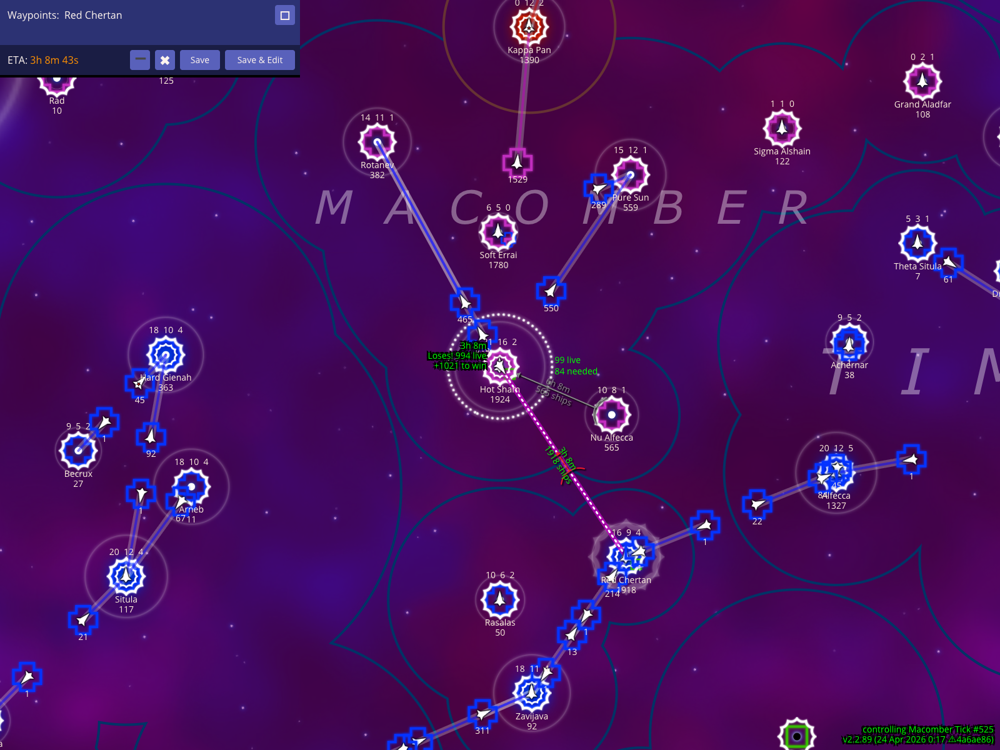
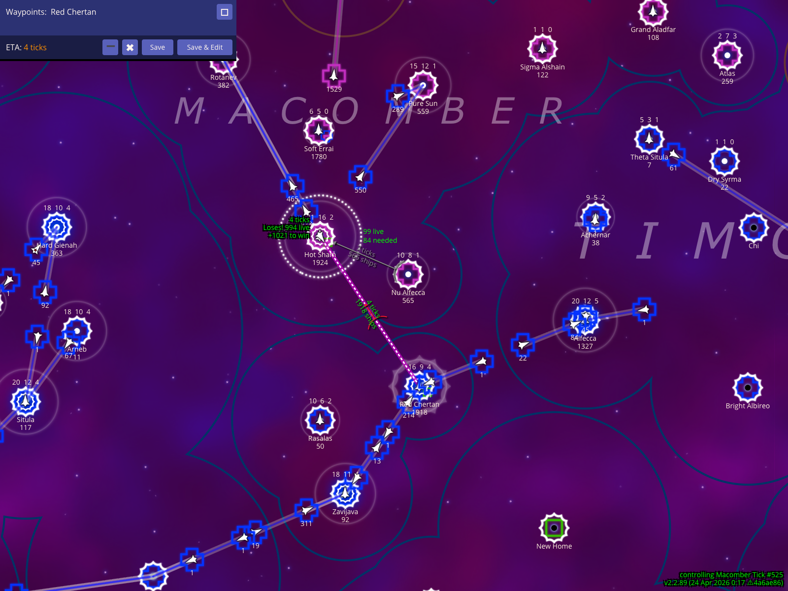
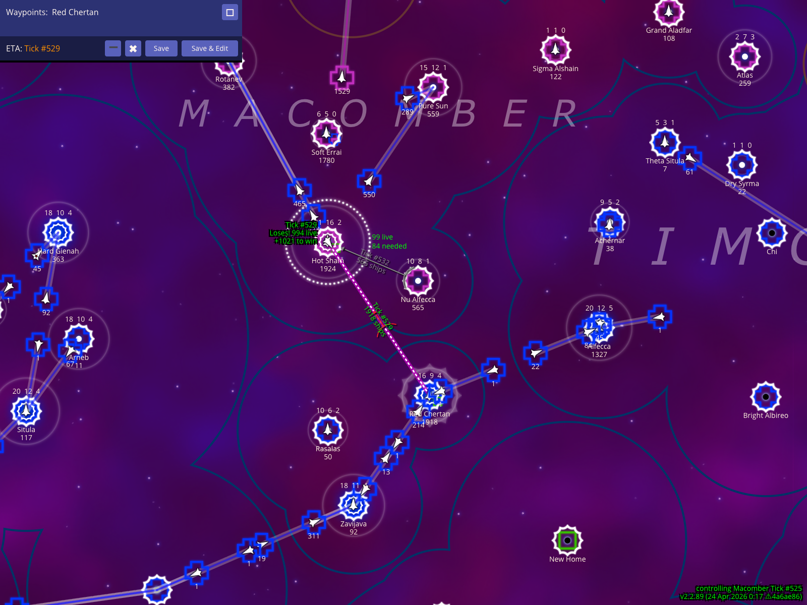
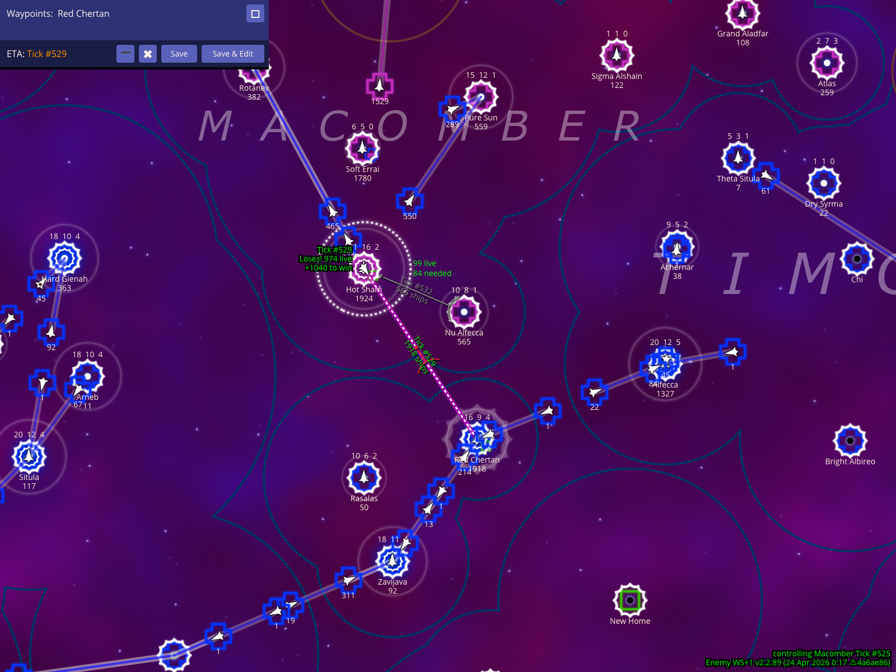

# Battle HUD Validation

Verify that the battle HUD workflow can select a frontline star, route a fake enemy fleet, cycle ETA timebases, and render combat handicap text.

Documentation target: `How to read the battle HUD`

Companion user documentation: [DOCS.md](./DOCS.md)

## Create a fake enemy fleet from the selected frontline star

### Verifications
- [x] The chosen frontline fixture star includes allied defenders, making it a battle-relevant target
- [x] The x hotkey creates and selects a synthetic enemy fleet for planning
- [x] The route editor shows a relative ETA for the fake enemy fleet
- [x] The screenshot frame keeps Hot Sham near the center with the selected fleet, route, and Red Chertan waypoint visible

## Cycle the battle ETA through clock time and relative ticks

### Verifications
- [x] The % hotkey produces an absolute clock-time ETA before moving to relative ticks
- [x] The route editor updates to the relative-ticks view
- [x] The relative-ticks screenshot still frames Hot Sham, the selected fake fleet, and the Red Chertan route

## Show the same battle ETA as absolute tick numbers

### Verifications
- [x] A further % press changes the ETA sample to an absolute tick number
- [x] The route editor reflects absolute tick-number mode
- [x] The absolute-tick screenshot keeps Hot Sham centered and the selected fleet route visible

## Model a worse-case fight by giving the enemy extra weapons

### Verifications
- [x] The . hotkey changes the rendered battle overlay in the HUD footer
- [x] The fake enemy fleet and battle route remain selected after applying the handicap
- [x] The handicap screenshot keeps the battle HUD footer visible while Hot Sham and its selected fleet route remain in frame

