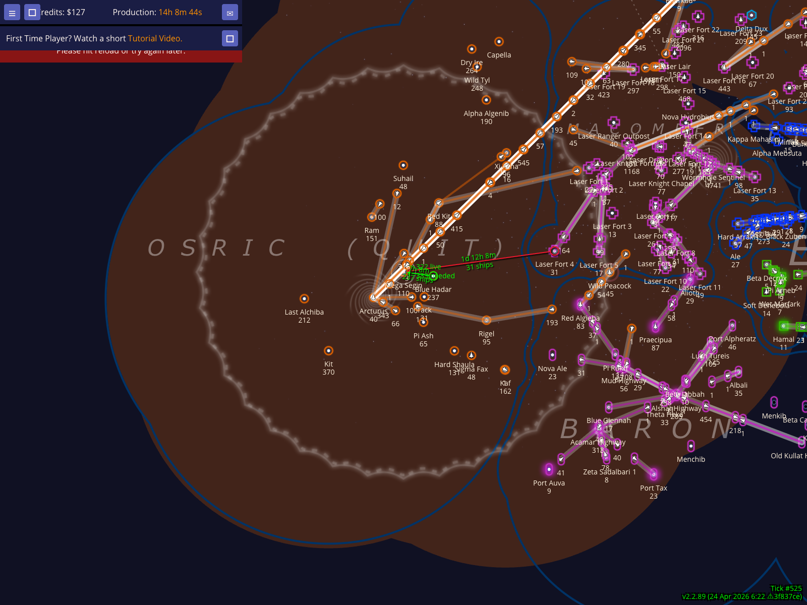
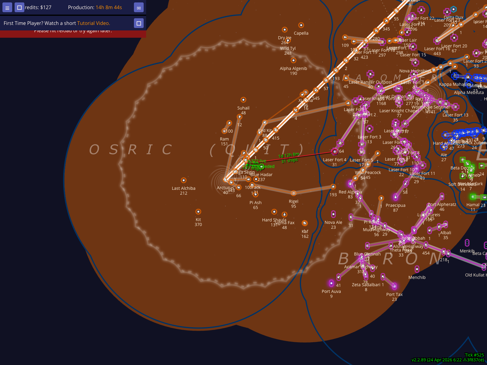
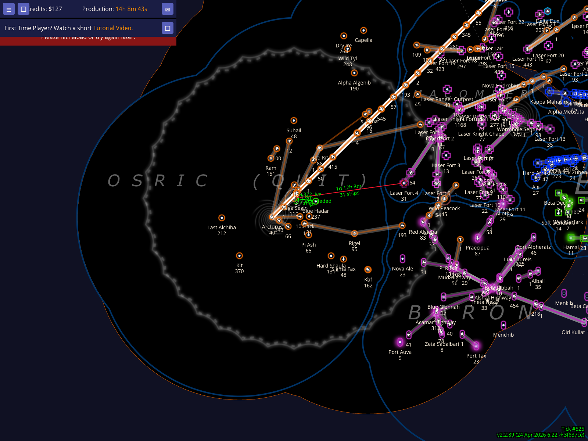
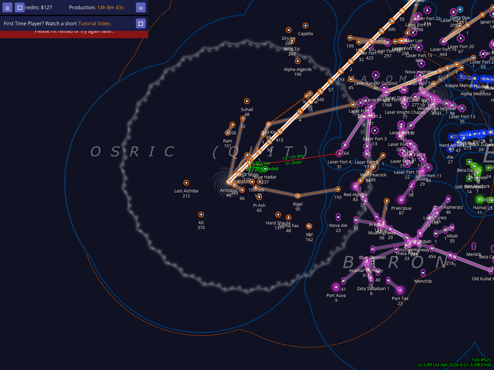
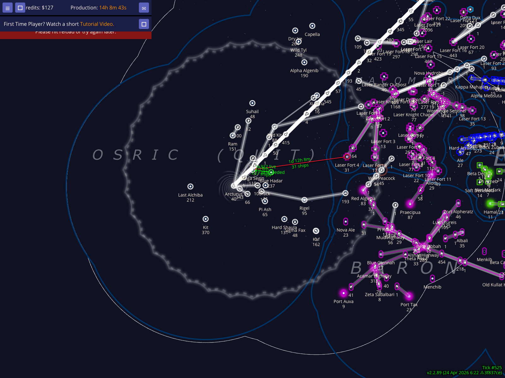
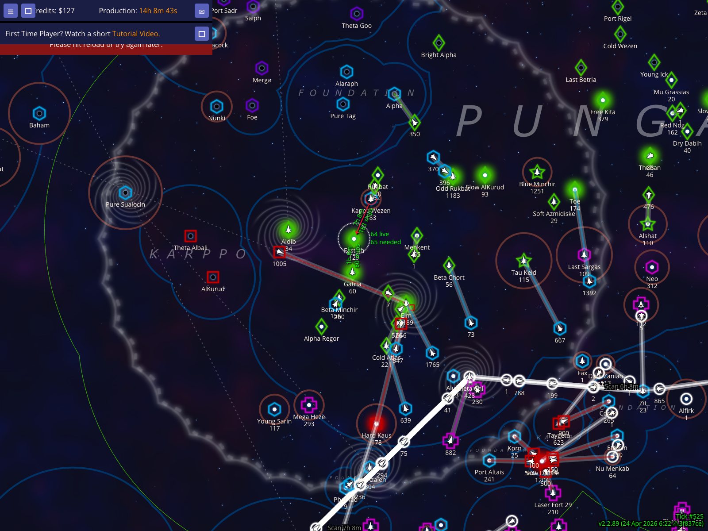
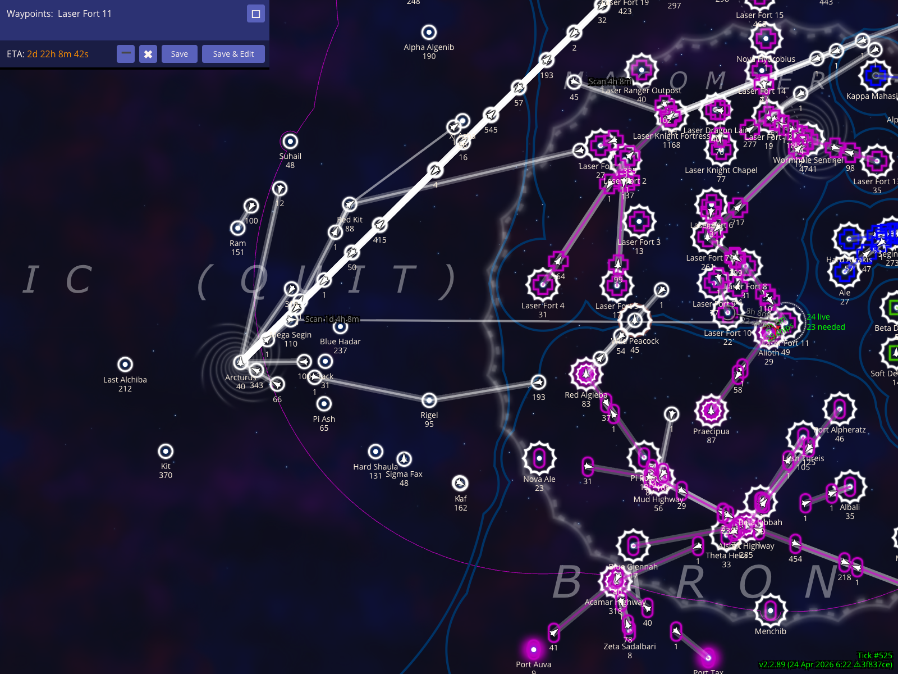

# Territory Display And Scanning HUD

The territory and scanning HUD overlays make the map easier to read while planning. They show which empire owns the selected area, let you cycle through four different territory rendering styles, optionally recolor your own empire white, and show exactly when any fleet will enter the scanning range of the selected star.

Book section: `Territory display and scanning HUD`

## Show the selected empire's territory and scanning reach

Select one of your stars, such as `Mega Segin`, to show the territory overlay for that empire. The colored territory shape summarizes the selected empire's local reach, while the map still shows nearby named stars for orientation.

### How to use it
- Select a star owned by the empire you want to inspect.
- Keep the map zoomed far enough out to see the surrounding territory edge.

### What to expect
- `Mega Segin` stays near the middle of the screenshot.
- The selected empire's territory overlay is visible around nearby Osric stars.
- The map still shows enough neighboring stars to understand where the territory edge sits.

## Cycle to territory display style 2

Style 2 offers a different visual balance between territory fill and map clarity. Comparison is easy as the view remains centered on `Mega Segin`.

### How to use it
- Press `Ctrl+9` to cycle to the next style.

### What to expect
- The territory rendering updates immediately.

## Cycle to territory display style 3

Style 3 offers a different visual balance between territory fill and map clarity. Comparison is easy as the view remains centered on `Mega Segin`.

### How to use it
- Press `Ctrl+9` to cycle to the next style.

### What to expect
- The territory rendering updates immediately.

## Cycle to territory display style 4

Style 4 offers a different visual balance between territory fill and map clarity. Comparison is easy as the view remains centered on `Mega Segin`.

### How to use it
- Press `Ctrl+9` to cycle to the next style.

### What to expect
- The territory rendering updates immediately.

## Recolor your empire white on the map

Press `w` to recolor your own empire white. This is useful when your normal player color blends into the nebula, territory fill, or another nearby empire's color. This comparison uses the same zoom and centering as the previous style examples.

### How to use it
- Select one of your own stars.
- Press `w` to toggle your map color to white.

### What to expect
- Your empire's map color changes to white.

## Green Scan ETA for a fleet not currently in scan

When you select a star, NPA calculates the scan ETA for any fleet crossing that star's scan border. If the fleet is not currently scanned by any of that player's other stars, the ETA is shown (drawn in green on the map).

### How to use it
- Select an enemy star that one of your fleets is approaching.
- NPA will show when that star specifically will gain a scan lock on your fleet.

### What to expect
- A scan ETA label appears near the fleet on the map.

## Grey Scan ETA for a fleet already scanned by another star

If the fleet is already within the scanning range of another star owned by the same player, the ETA is considered 'grey' (though technically drawn in the same style, it represents a redundant scan lock).

### How to use it
- Select the enemy star your fleet is approaching.
- Compare ETAs if multiple fleets are approaching.

### What to expect
- Scan ETA labels appear for all approaching fleets that will cross the border.

## Measure scan ETA with a fake fleet route

You can also use fake fleets to plan routes and see exactly when they will enter enemy scan. This is vital for timing 'dark' jumps where you want to arrive or change course just before being detected.

### How to use it
- Press `x` to create a fake planning fleet.
- Add waypoints to the destination.
- Select the destination star to see the scan ETA for that route.

### What to expect
- The scan HUD displays the expected entry tick for the planned route.

