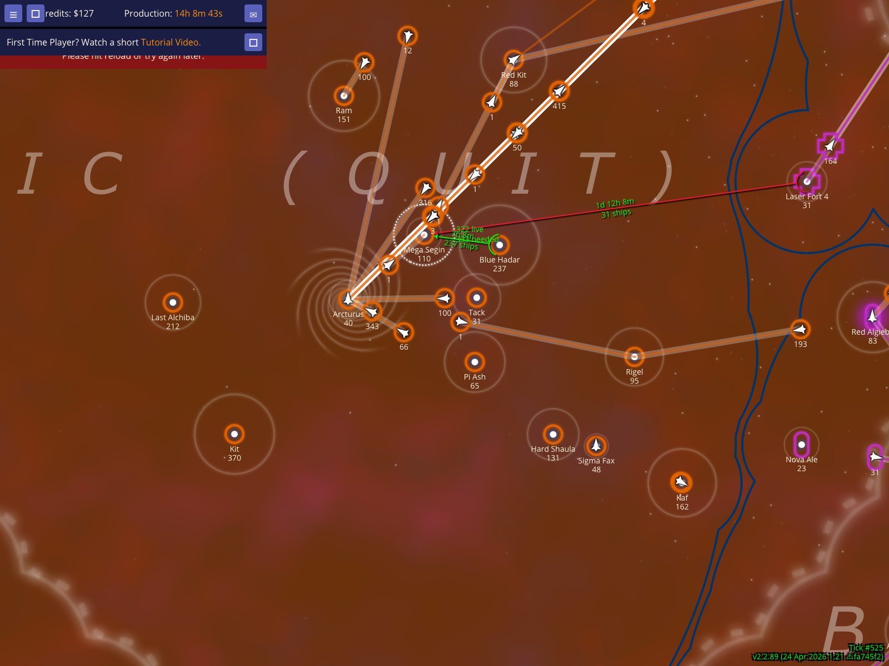
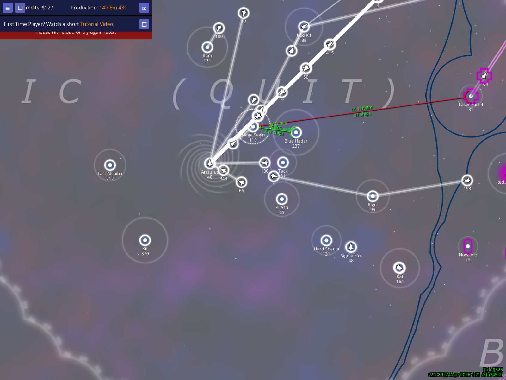
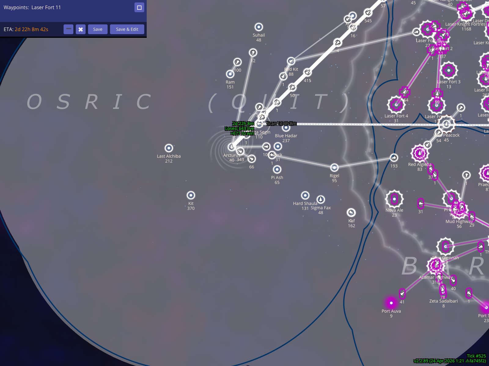

# Territory Display And Scanning HUD

The territory and scanning HUD overlays make the map easier to read while planning. They show which empire owns the selected area, let you change the territory rendering style, optionally recolor your own empire white, and show when a routed fleet will enter an enemy's scanning range.

Book section: `Territory display and scanning HUD`

## Show the selected empire's territory and scanning reach

Select one of your stars, such as `Mega Segin`, to show the territory overlay for that empire. The colored territory shape summarizes the selected empire's local reach, while the map still shows nearby named stars for orientation.

### How to use it
- Select a star owned by the empire you want to inspect.
- Keep the map zoomed far enough out to see the surrounding territory edge.

### What to expect
- `Mega Segin` stays near the middle of the screenshot.
- The selected empire's territory overlay is visible around nearby Osric stars.
- The map still shows enough neighboring stars to understand where the territory edge sits.

## Cycle the territory display style

Press `Ctrl+9` to cycle the territory display style. This changes how strongly NPA draws the selected empire's territory, which helps when the default fill is either too subtle or too dominant for the current map background.

### How to use it
- Select the empire or star whose territory you are inspecting.
- Press `Ctrl+9` to advance to the next territory style.
- Use `Ctrl+8` if you want to cycle backward instead.

### What to expect
- The territory overlay changes style without changing the selected star.
- `Mega Segin` remains centered so you can compare the new rendering against the previous view.

## Recolor your empire white on the map

Press `w` to recolor your own empire white. This is useful when your normal player color blends into the nebula, territory fill, or another nearby empire's color.

### How to use it
- Select one of your own stars.
- Press `w` to toggle your map color to white.
- Press `w` again later if you want to return to your normal color.

### What to expect
- Your empire's map color changes to white.
- `Mega Segin` and the surrounding territory remain in the same frame so the color change is easy to compare.

### Caveats
- This is a local display preference. It does not change your real player color for anyone else.

## Measure scan ETA with a fake fleet route

Create a fake fleet from `Mega Segin`, route it to enemy-held `Laser Fort 11`, then select `Laser Fort 11` while the fake route remains visible. NPA shows a scan ETA near the moving fleet so you can tell when that fleet should enter the enemy's scanning range.

### How to use it
- Select your origin star, here `Mega Segin`.
- Press `x` to create a fake planning fleet.
- Add the enemy star, here `Laser Fort 11`, as the waypoint.
- Select the enemy star while keeping the fake fleet route visible.

### What to expect
- `Mega Segin`, the synthetic fleet, and the scan ETA label stay near the middle of the screenshot.
- `Laser Fort 11` remains visible at the right end of the route.
- The scan HUD displays a label such as `Scan Tick #531`, showing when the routed fleet should become visible to the selected enemy star's owner.

### Caveats
- The fake fleet is a local planning object. It does not submit orders to Neptune's Pride.
- The scan ETA depends on the selected star's owner and the current route. If you select a different enemy star, the displayed scan tick can change.

