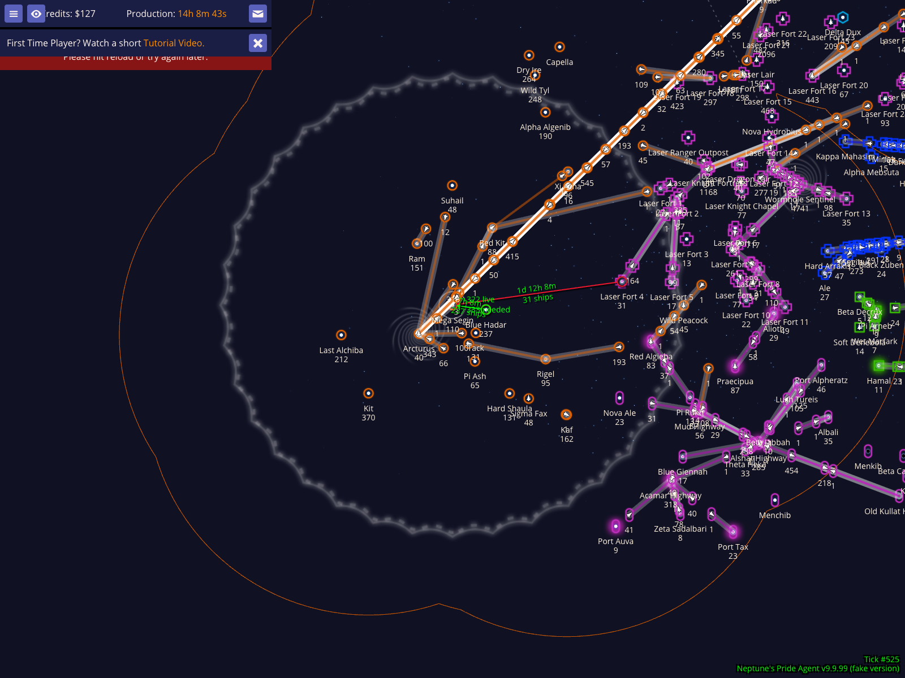
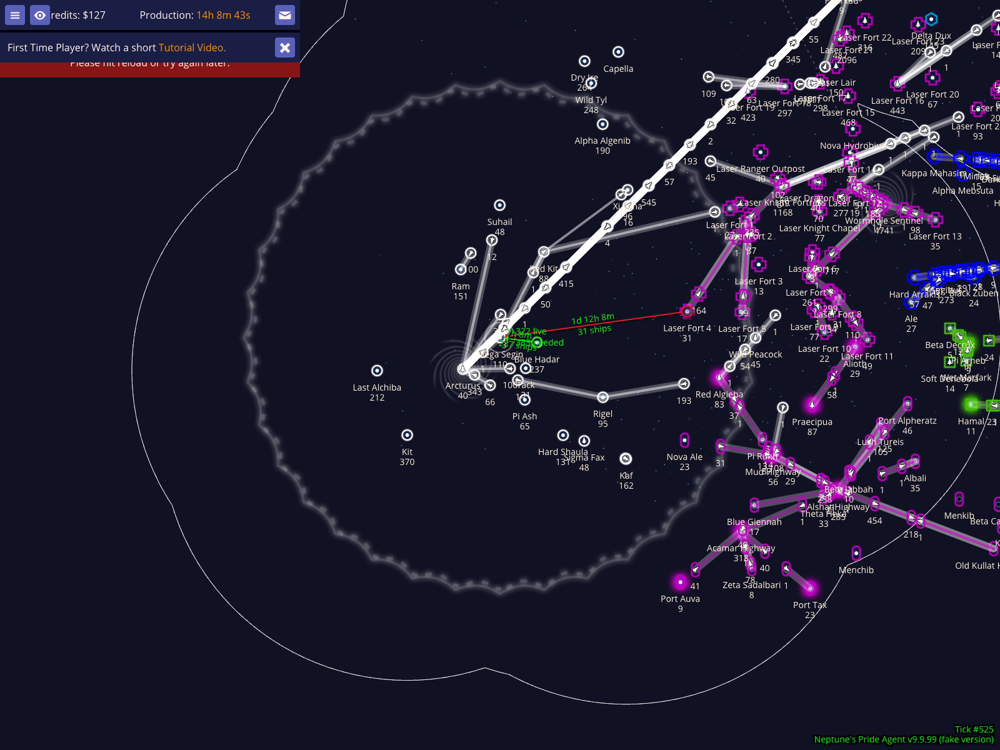
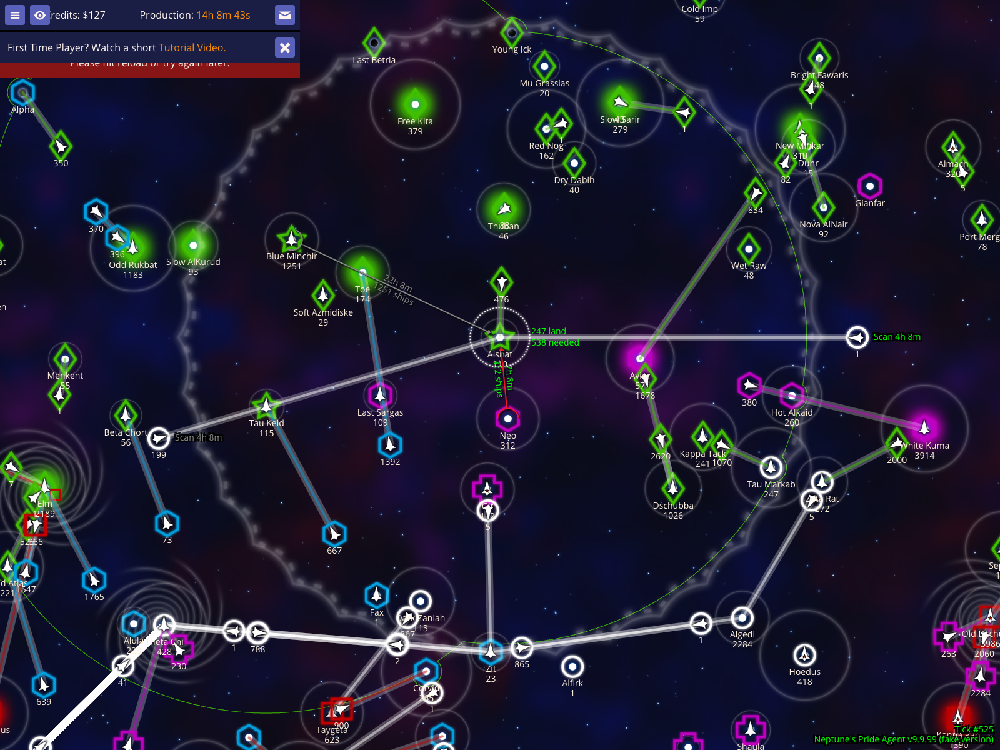

# Territory Display And Scanning HUD Validation

Verify that the territory overlay can be framed, restyled through all four modes, recolored to white, and combined with both existing and fake fleets to measure scan ETA.

Documentation target: `Territory display and scanning HUD`

Companion user documentation: [DOCS.md](./DOCS.md)

## Visualize empire reach with territory overlays

### Verifications
- [x] The fixture starts with Mega Segin selected for Osric
- [x] The screenshot frame keeps Mega Segin near the center with nearby Osric territory visible

## Cycle to territory rendering style: Bright Haze

### Verifications
- [x] The territory style is now 2

## Cycle to territory rendering style: Black Background with Outlines

### Verifications
- [x] The territory style is now 3

## Cycle to territory rendering style: Outlines Only

### Verifications
- [x] The territory style is now 4

## Toggle political map borders and empire names

### Verifications
- [x] The ctrl+0 hotkey toggles the visibility of political borders and empire names

## Recolor your empire white on the map

### Verifications
- [x] The w hotkey changes the current player's map color to white

## Green and Grey Scan ETAs for multiple fleets

### Verifications
- [x] Selecting Alshat shows multiple scan ETAs: Green for unscanned fleets and Grey for already scanned fleets
- [x] The scan HUD example includes one green indicator and one grey indicator in the screenshot frame

## Measure scan ETA with a fake fleet route

### Verifications
- [x] The scan HUD calculation predicts the tick when the fake fleet enters Laser Fort 11's scanning range
