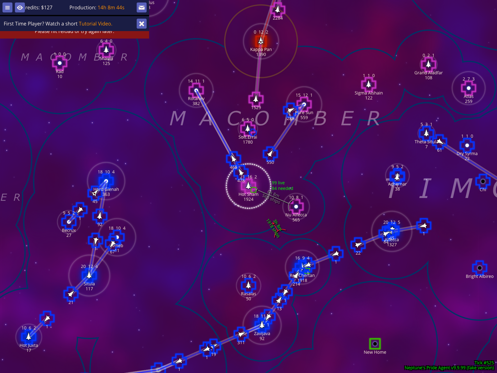
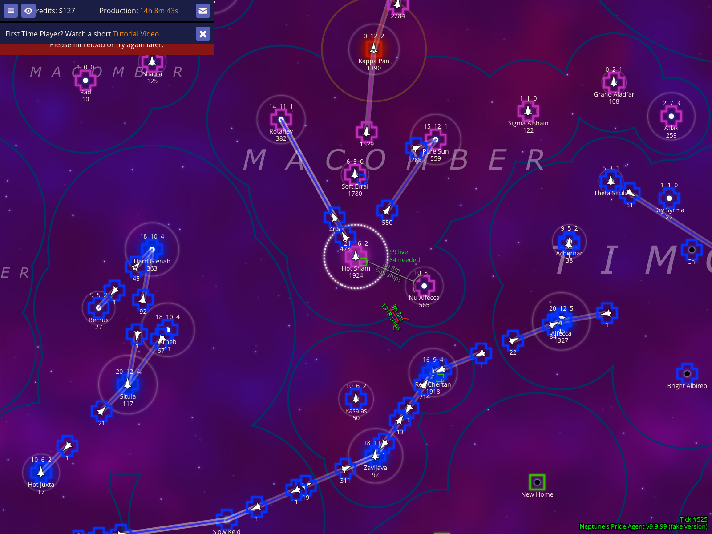
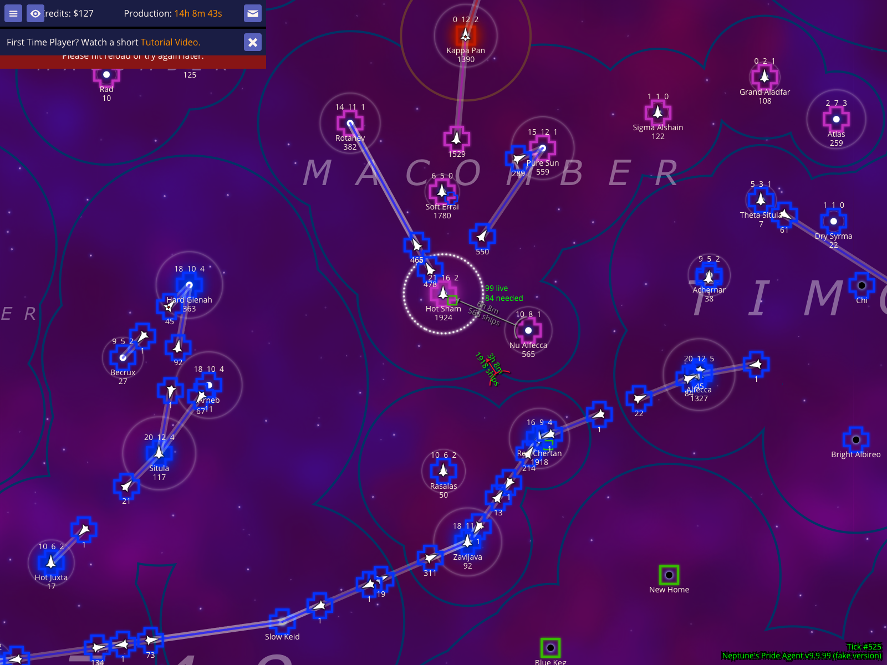
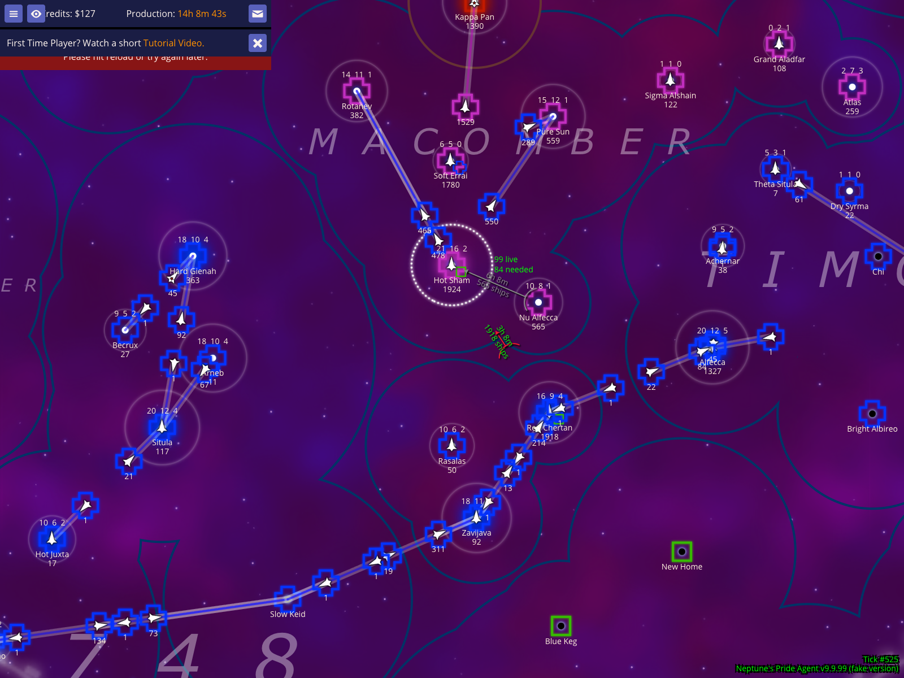

# Auto-Ruler Validation

Verify that the auto-ruler correctly identifies and visualizes distances to enemy and support stars, and responds to power controls.

Documentation target: `Interpreting and controlling the auto-ruler`

Companion user documentation: [DOCS.md](./DOCS.md)

## View automatic distance measurements to the nearest stars

### Verifications
- [x] Selecting a star activates the auto-ruler for that location

## Increase the number of stars shown by the auto-ruler

### Verifications
- [x] Pressing 9 increases the auto-ruler power

## Decrease the number of stars shown by the auto-ruler

### Verifications
- [x] Pressing 8 decreases the auto-ruler power

## Distinguish between effective and ineffective support

### Verifications
- [x] The ruler remains visible for the selected star
