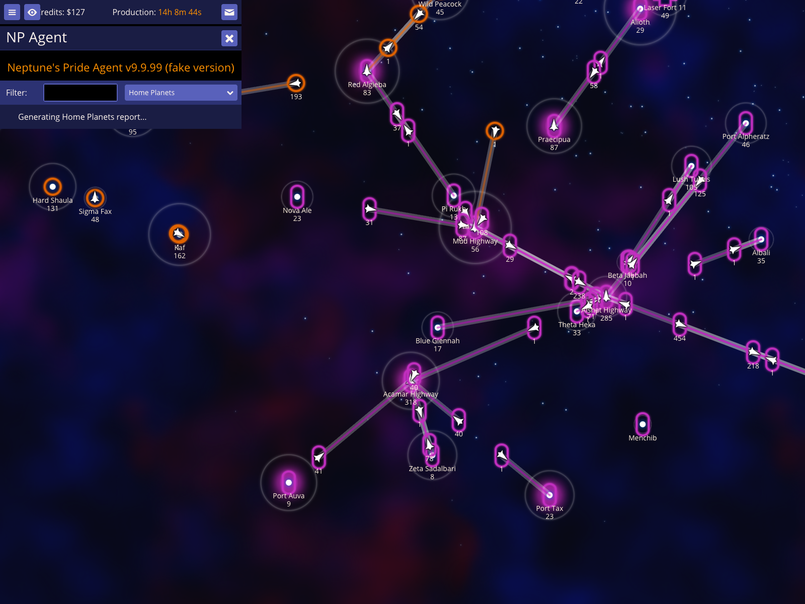
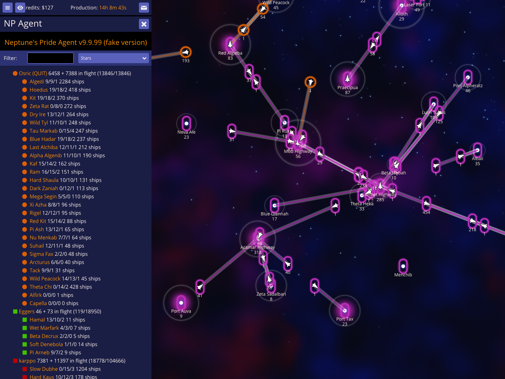
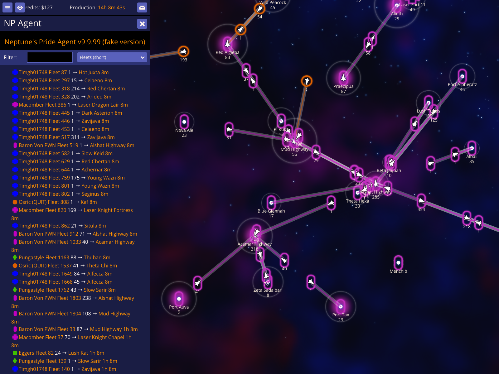
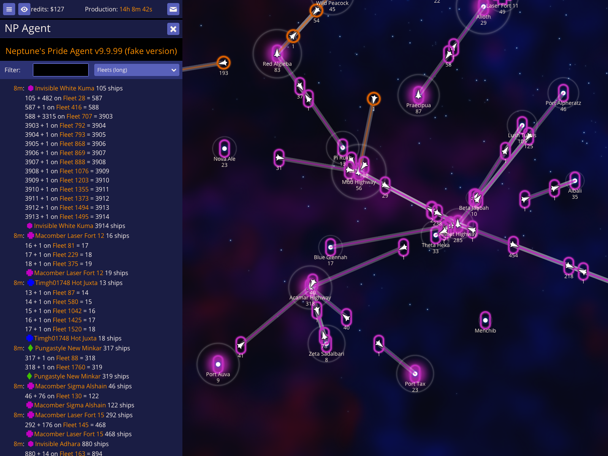
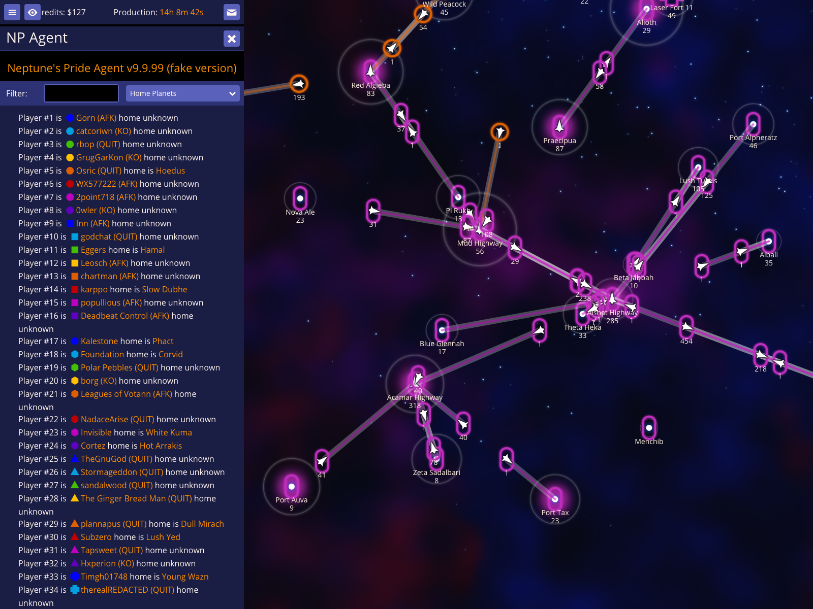

# Star and Fleet Reports

NPA provides a variety of detailed reports to help you track your empire's status and monitor enemy movements. These reports can be viewed directly in the Agent UI or copied to the clipboard for sharing in diplomatic messages.

## Open the NP Agent UI

Access the central intelligence hub by pressing **`** (backtick). This opens the NPA report screen where you can select from a wide range of automated analysis tools.

### How to use it
- Press **`** to open the Agent UI.

### What to expect
- The NP Agent overlay appears, showing a report selector and a filter input.

## View the Stars report

The **Stars** report provides a comprehensive breakdown of every star currently within your scanning range, grouped by owner. It includes infrastructure levels (Economy/Industry/Science) and total defensive ship counts.

### How to use it
- Open the Agent UI (**`**).
- Select **Stars** from the dropdown menu.

### What to expect
- A detailed list of stars appears, showing production and ship totals for each player.

## View the Fleets (short) report

The **Fleets (short)** report is a high-level summary of active fleet movements. It lists upcoming arrivals and provides a total count of ships in flight for every visible empire.

### How to use it
- Select **Fleets (short)** from the report dropdown.

### What to expect
- The report displays a chronological list of fleet arrivals followed by per-player totals.

## View the Fleets (long) report

For a deeper analysis, the **Fleets (long)** report calculates the projected outcome of every visible fleet movement. It accounts for weapons technology and defensive bonuses to show you exactly how many ships are expected to survive each encounter.

### How to use it
- Select **Fleets (long)** from the report dropdown.

### What to expect
- A detailed breakdown of every flight appears, including projected survivors for defenders or attackers.

## View the Home Planets report

The **Home Planets** report cross-references every player with their starting star. This is invaluable for identifying player numbers (e.g., `Player #5`) and tracking whether an empire still controls its original capital.

### How to use it
- Select **Home Planets** from the report dropdown.

### What to expect
- The report lists each player number, their current alias, and their home star status.
