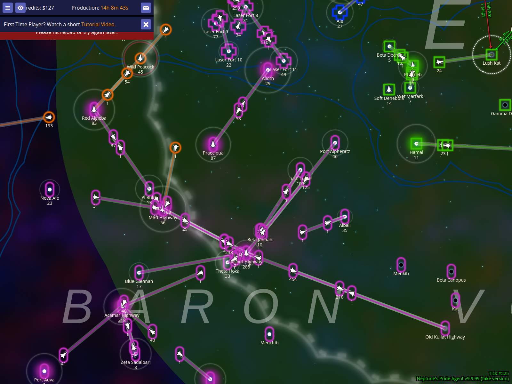
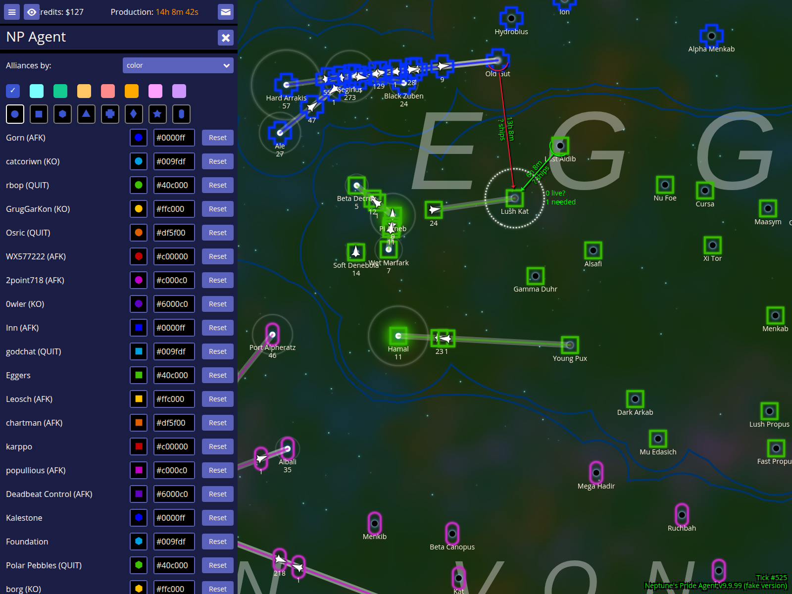
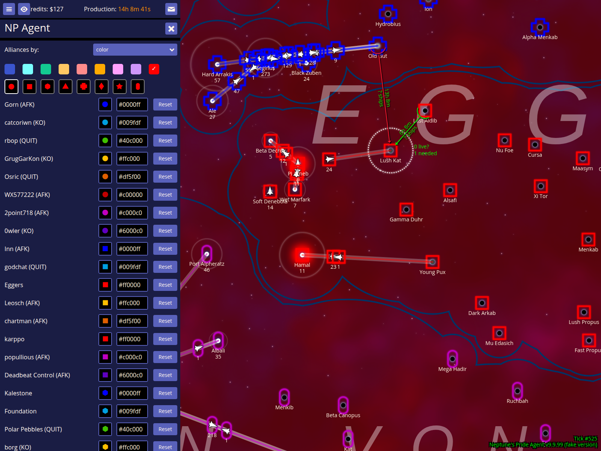
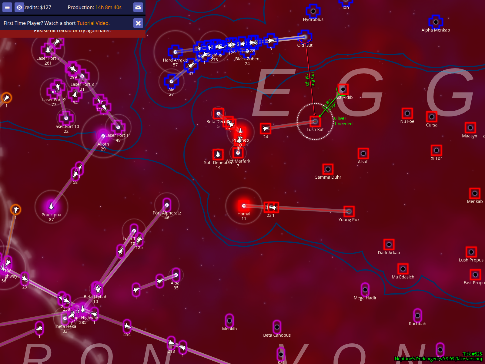

# Managing Empires and Alliances

NPA allows you to recolor players on the map and group them into alliances for better reporting and coordination.

## Show the map with default player colors

By default, players are shown with their original game colors. This ensures that the map remains familiar while you begin your tactical planning.

### How to use it
- Open the map to see the current state of the galaxy.

### What to expect
- Players are distinguished by their default colors on the map and in reports.

## Open the Colours and Shapes configuration screen

Press **Ctrl+a** to open the Colours and Shapes screen. This tool is essential for clarifying the political landscape by assigning custom colors and shapes to players.

### How to use it
- Press **Ctrl+a** while viewing the map.

### What to expect
- A configuration screen appears listing all players in the game, along with color swatches and shape options.

## Change Player 11 (Eggers) to red

To highlight a specific player, such as a primary target, you can change their color. In this example, we've changed `Eggers` to bright red.

### How to use it
- Locate the player you want to recolor in the list.
- Click the color hex field and type a new color (e.g., `#ff0000` for red).

### What to expect
- The player's name and territory will now be rendered in the selected color.

## Group Player 14 (karppo) into the same alliance by color

By assigning the same color to multiple players, NPA treats them as an alliance in reports.

### How to use it
- Give two or more players the exact same color hex value.

### What to expect
- The players will share the same color on the map, visually representing their alliance.

## Open the Empires report to see the grouped alliance

The Empires report (**Ctrl+l**) uses your custom colors to group players.

### How to use it
- Press **Ctrl+l** to open the Empires report.

### What to expect
- Players with the same color are listed together under an 'Alliance' header.
