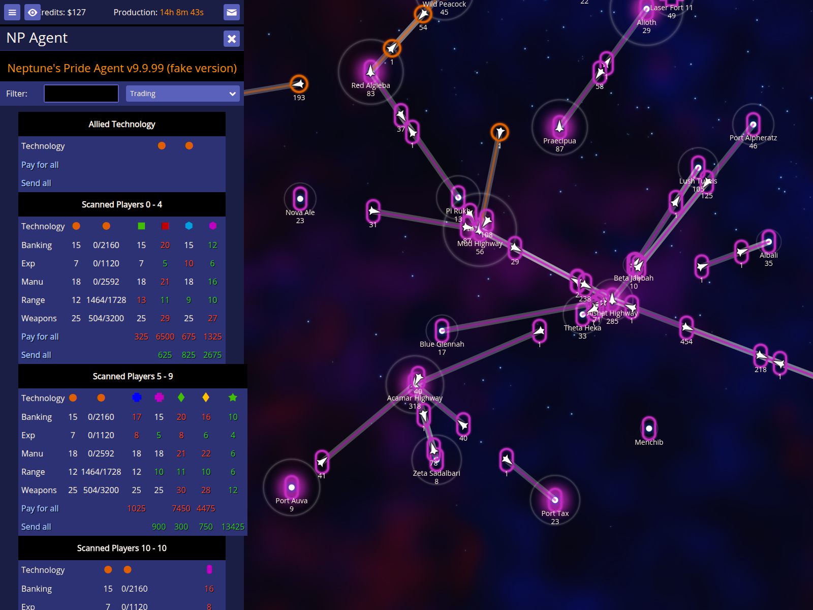
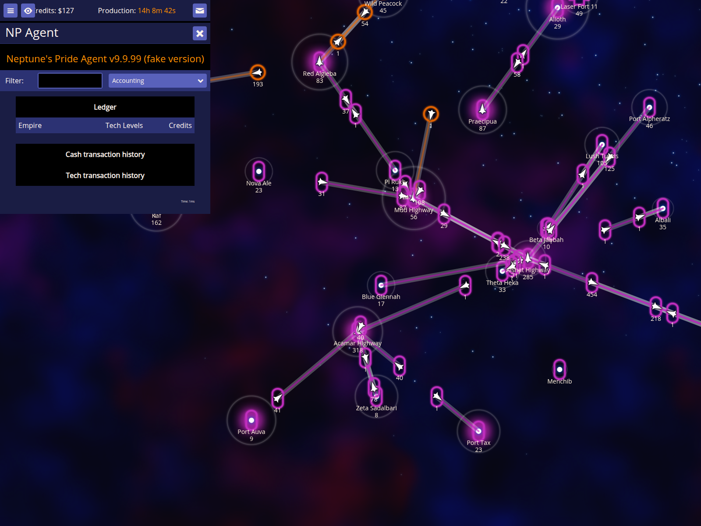
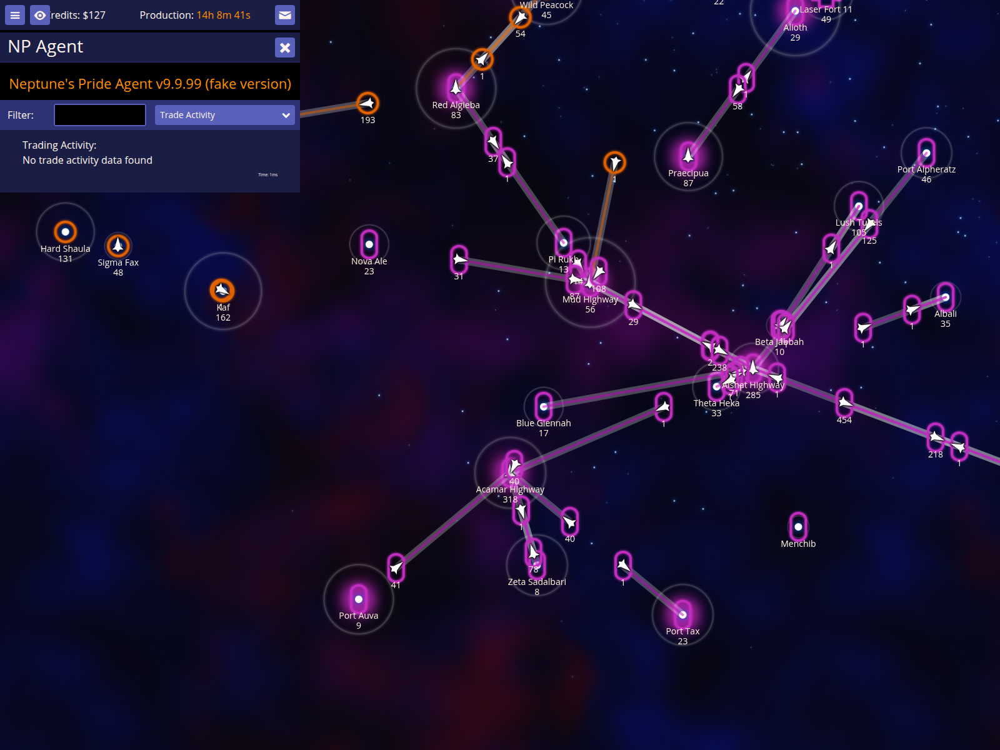

# Accounting and Trading Validation

Verify that the trading, accounting, and trade activity reports display correct information and can be accessed via menu items.

Documentation target: `Accounting and Trading`

Companion user documentation: [DOCS.md](./DOCS.md)

## Open the trading report to see technology levels across the alliance

### Verifications
- [x] The trading report can be opened from the menu
- [x] The trading report shows technology levels with colored indicators

## Clicking a technology level opens the trade dialog

### Verifications
- [x] Clicking a green number opens the trade dialog

## Open the accounting report to see cash and tech transaction history

### Verifications
- [x] The accounting report can be opened from the menu and shows headers

## Open the trade activity report to see definite trades between other empires

### Verifications
- [x] The trade activity report can be opened from the menu
