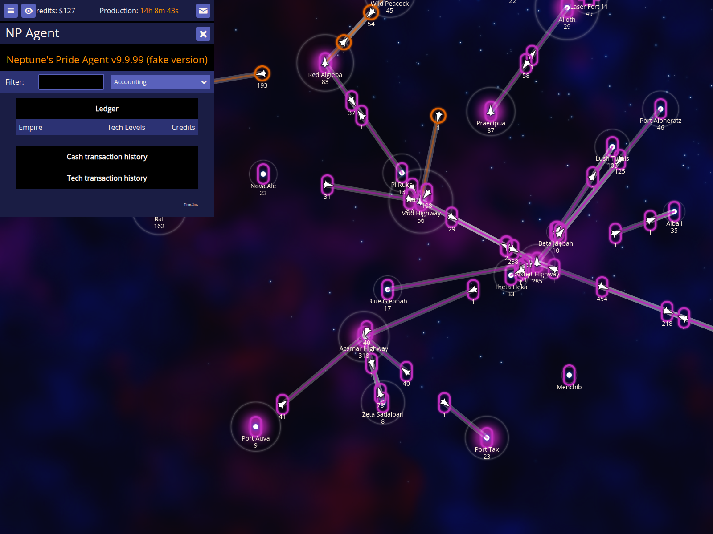
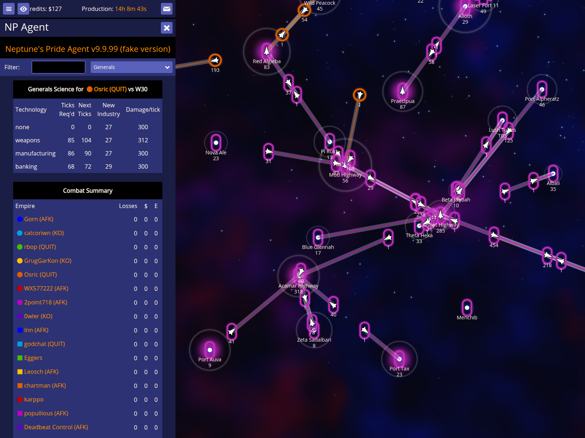

# Economists and Generals Reports Validation

Verify that the Economists and Generals reports can be triggered via hotkeys and display the expected summary information.

Documentation target: `Economists and Generals`

Companion user documentation: [DOCS.md](./DOCS.md)

## Trigger and verify the Economists report

### Verifications
- [x] The ctrl+4 hotkey opens the Economists report

## Trigger and verify the Generals report

### Verifications
- [x] The ctrl+w hotkey opens the Generals report
- [x] The report summarizes science progress and combat damage
