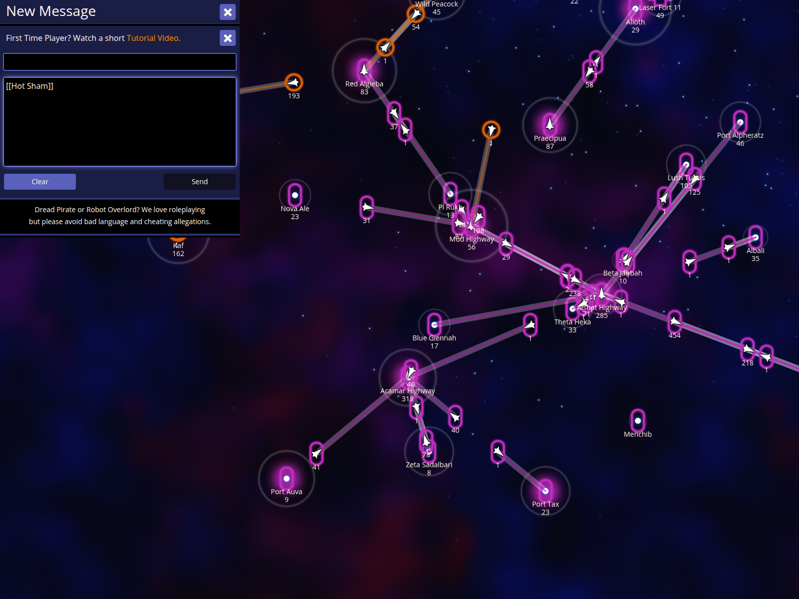

# Messaging Support

NPA enhances the messaging experience with automated report insertion, screenshot sharing, and intelligent autocomplete for player and star names.

## Use autocomplete to quickly insert star names in the compose screen

NPA's intelligent autocomplete works in any message composition area. By typing two square brackets followed by a partial name, you can quickly insert the full name of any star or player.

### How to use it
- In the message box, type **[[** followed by a few letters (e.g., `[[Hot`).
- Press **]** to automatically complete the name.

### What to expect
- The partial text is replaced by the full name, such as `[[Hot Sham]]`.

## Use the Intel and Screenshot buttons to share game state

NPA adds **Intel** and **Screenshot** buttons to the standard messaging interface. These allow you to quickly share data without manual copying and pasting.

### How to use it
- In any message reply box, look for the **Intel** and **Screenshot** buttons.
- Click **Intel** to paste your last viewed report.
- Click **Screenshot** to capture the current map view and share a link to it.

### What to expect
- The buttons are seamlessly integrated into the message box.
- Intelligence data or image links are automatically appended to your message draft.
