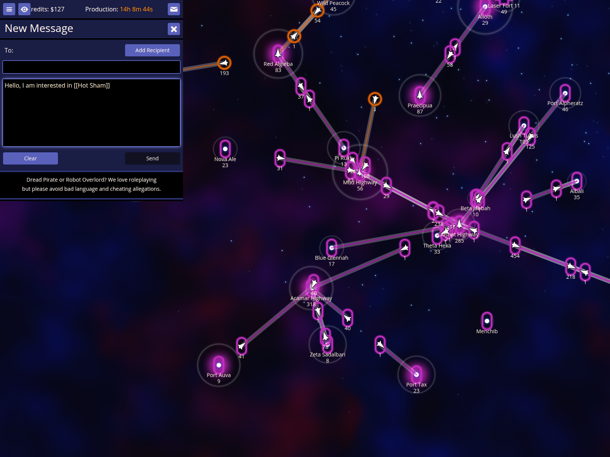
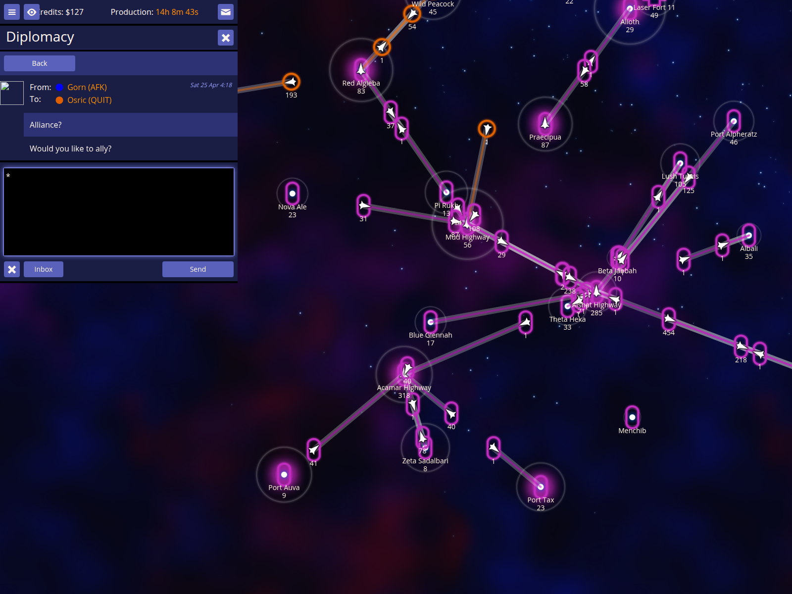

# Messaging Support

NPA enhances the messaging experience with automated report insertion, screenshot sharing, and intelligent autocomplete for player and star names.

## NPA enhances the message composition screen with autocomplete for stars and players.

NPA's intelligent autocomplete works in any message composition area. By typing two square brackets followed by a partial name, you can quickly insert the full name of any star or player.

### How to use it
- In the message box, type **[[** followed by a few letters of a star or player name (e.g., `[[Hot`).
- Press **]** to automatically complete the name.

### What to expect
- The partial text is replaced by the full name wrapped in brackets, such as `[[Hot Sham]]`.

## The Intel and Screenshot buttons allow you to quickly share data and images.

Sharing intelligence and visual data is essential for coordination. NPA provides dedicated buttons in the message composition area to automate these tasks.

### How to use it
- View any report (e.g., by pressing **`**) to put it on your intelligence clipboard.
- In a message box, click **Intel** to paste the last report.
- Click **Screenshot** to capture your current map view and insert a shareable link.

### What to expect
- Intelligence data or map screenshot links are automatically appended to your message draft.
