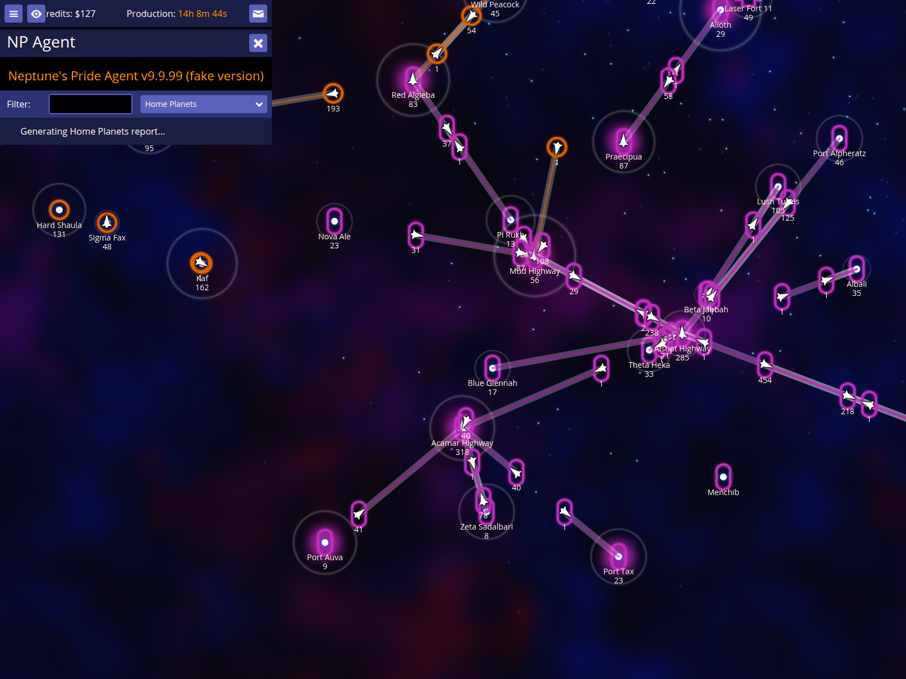
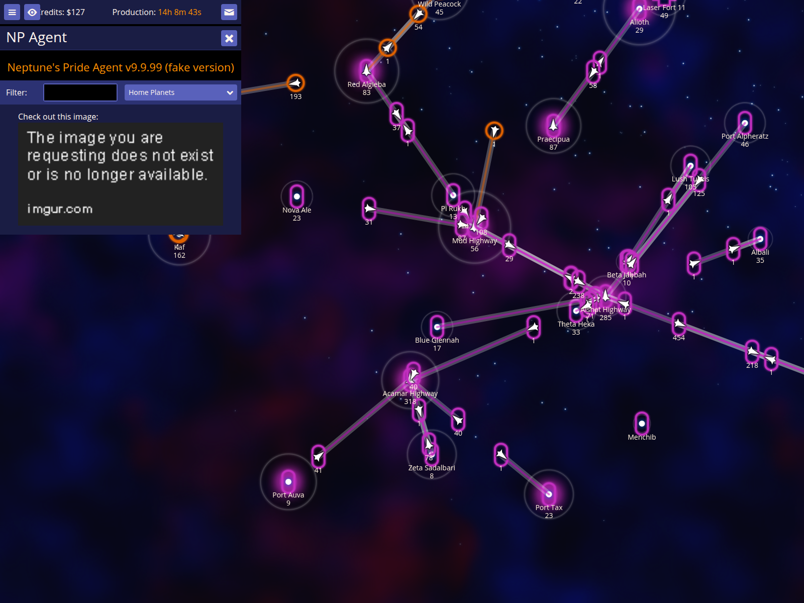
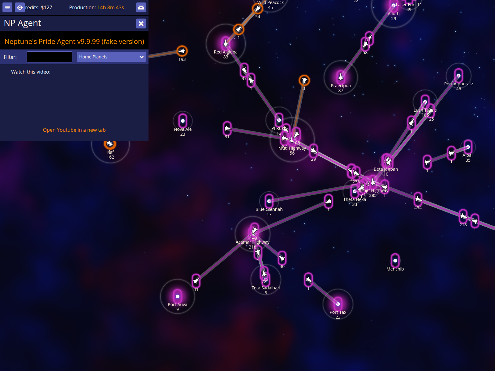

# Embedded Content Validation

Verify that NPA renders embedded images and YouTube videos when provided with specific URL patterns in double brackets.

Documentation target: `Embedded content`

Companion user documentation: [DOCS.md](./DOCS.md)

## Open the NP Agent UI

### Verifications
- [x] Pressing ` opens the NPA report screen

## Render an embedded image from Imgur

### Verifications
- [x] Double-bracketed Imgur URLs render as  tags

## Render an embedded YouTube video

### Verifications
- [x] Double-bracketed YouTube URLs render as <iframe> embeds
