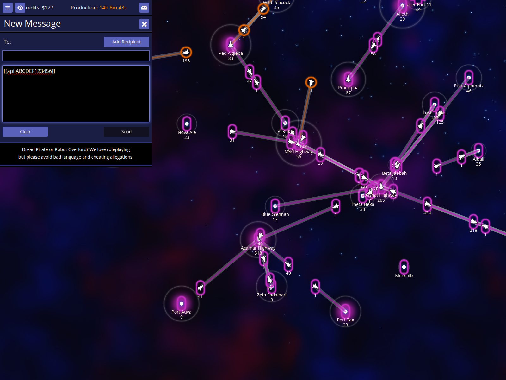
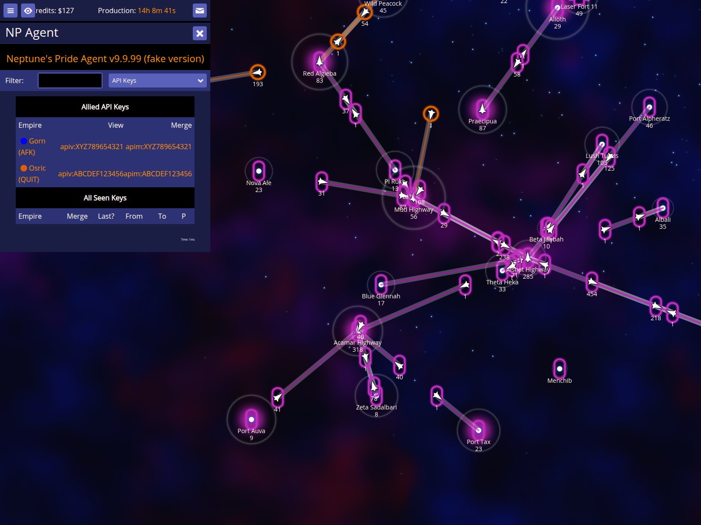

# Embedding API Keys

Verify that API keys can be autocompleted in text inputs, detected in messages, and viewed in the API Keys report.

Documentation target: `API Keys`

Companion user documentation: [DOCS.md](./DOCS.md)

## Autocomplete your own API key in a text input

### Verifications
- [x] The API key is set in the agent's memory
- [x] Typing [[api: in a textarea autocompletes the key

## Detect an API key in a message

### Verifications
- [x] A message containing an API key tag is detected by NPA

## Show the API Keys report

### Verifications
- [x] The hotkey 'k' opens the API Keys report
- [x] The report lists all seen keys with options to View or Merge
