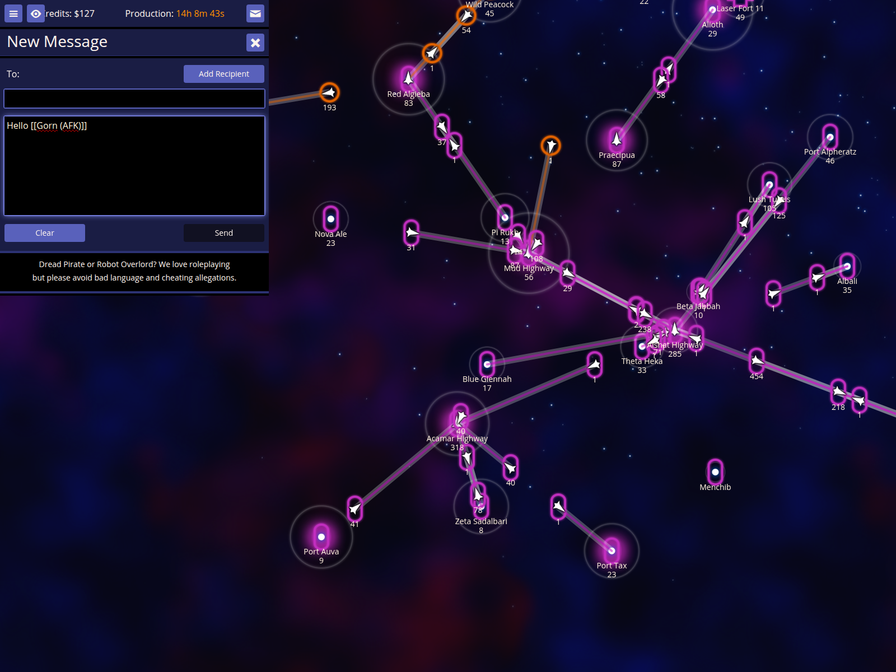
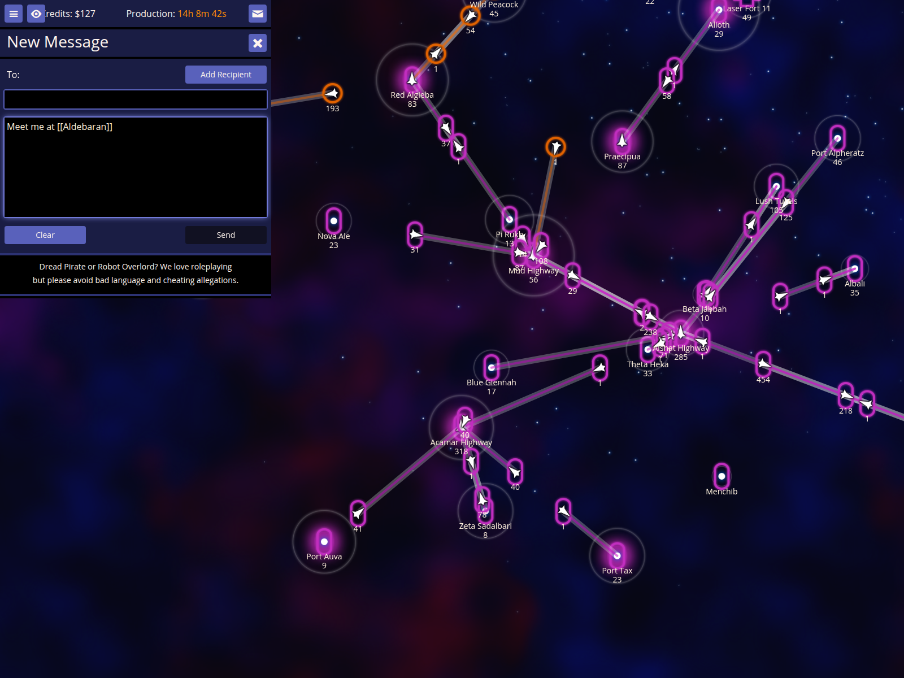

# Autocomplete

Autocomplete is a powerful feature when composing messages to other players. NPA provides several triggers to help you quickly insert player names and star names into text fields.

## Autocompleting a player name by their ID

You can quickly insert a player's name by their numeric ID when writing messages.

### How to use it
- Open the **Compose** message screen.
- Type `[[` followed by the player's ID number.
- Press **]** to complete the name.

### What to expect
- The `[[ID]]` sequence is replaced by the player's full alias enclosed in double brackets.

## Cycling through multiple players matching a prefix

When multiple players match your search, you can cycle through them using the completion key.

### How to use it
- Type `[[` followed by the start of a player's name.
- Press **]** repeatedly to cycle through all matching players.

### What to expect
- NPA cycles through all players whose names contain the text you typed.

## Autocompleting star names

Star names can also be autocompleted, making it easy to coordinate with allies.

### How to use it
- Type `[[` followed by part of a star's name.
- Press **]** to complete the name.

### What to expect
- The star name is inserted, correctly formatted for game links.
