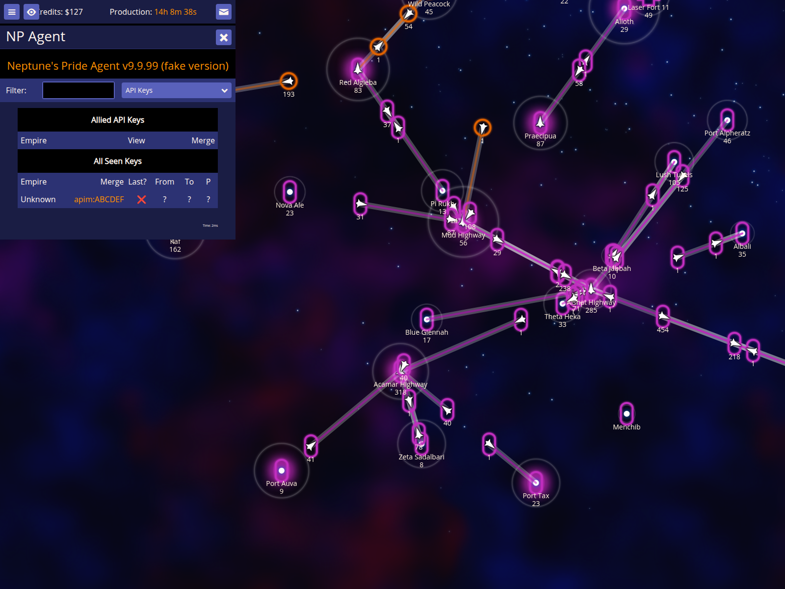
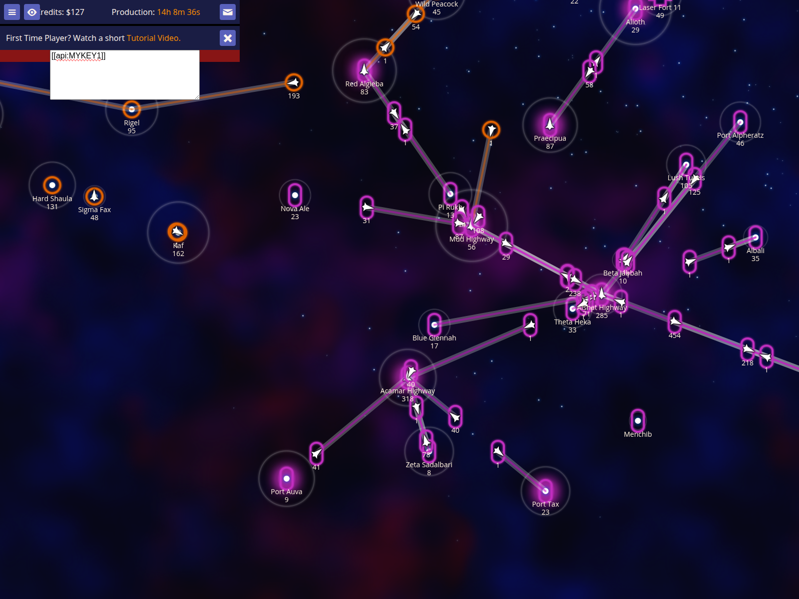

# API Keys Documentation

Verify that API keys can be detected from messages, viewed in the dashboard, and used for autocomplete.

Documentation target: `API keys`

Companion user documentation: [DOCS.md](./DOCS.md)

## Detecting API keys from messages

### Verifications
- [x] A message containing an API key is detected and shown in the dashboard

## Viewing the API keys dashboard details

### Verifications
- [x] The dashboard header is visible
- [x] A 'Merge' link (apim:ABCDEF) is present for the detected key

## Using autocomplete for your own API key

### Verifications
- [x] Typing [[api: in a message triggers autocomplete for the user's own key
