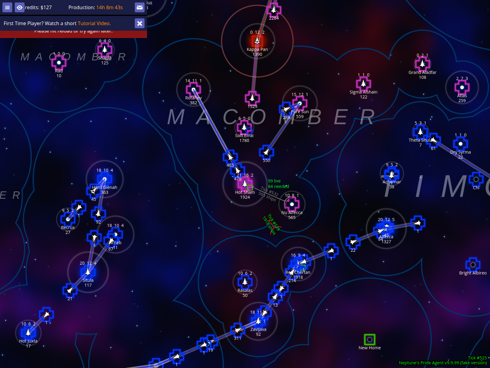
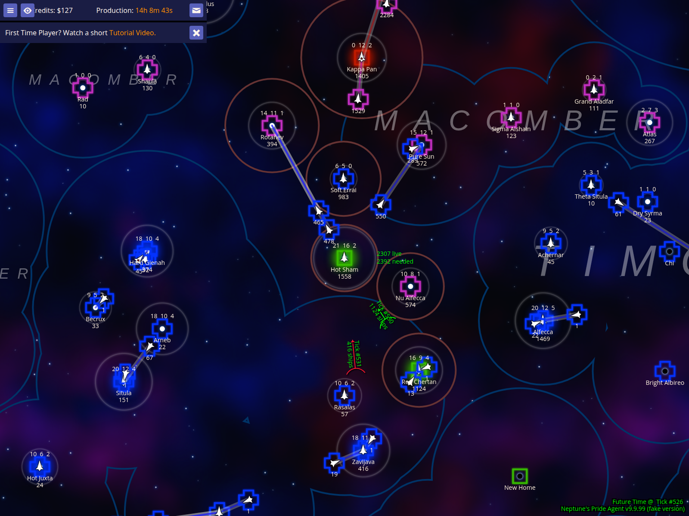
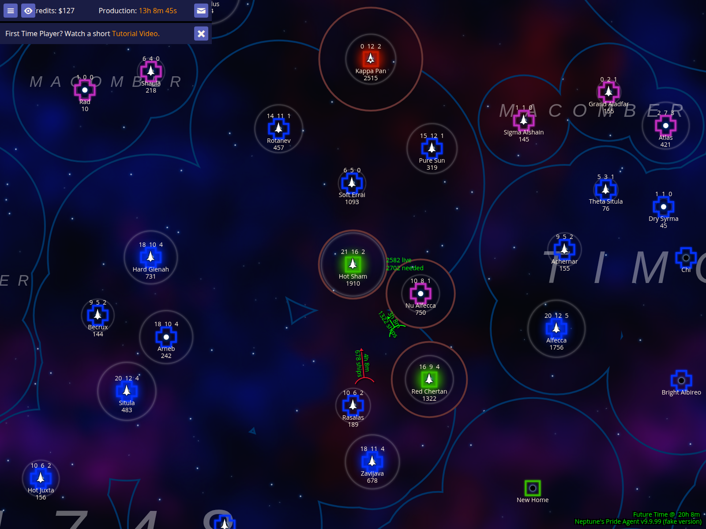
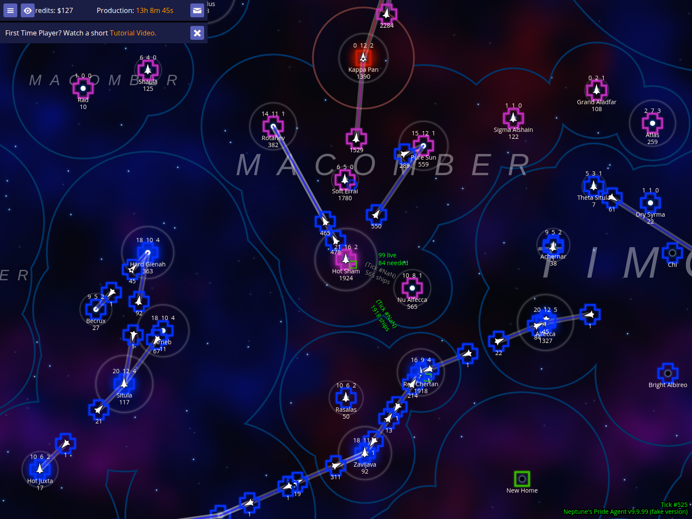

# Navigating Time with the Time Machine

NPA's Time Machine allows you to project the game state forward to see future ship production and fleet arrivals, or look back at historical snapshots to analyze past events.

## View the current game state at the present tick

The Time Machine starts at the 'Present'—the most recent data received from the server. In this baseline view, all ship counts and fleet positions reflect the current state of the galaxy.

### How to use it
- Open the map to see your current game state.
- Notice the absence of any 'Future Time' overlay in the bottom right, indicating you are viewing the present.

### What to expect
- The map displays the current tick (e.g., `Tick #525`).
- Fleets and stars show their current ship counts.

## Project the game state forward by one tick

You can project the galaxy forward by one tick to see immediate changes. Press **ctrl+.** to advance time. NPA calculates expected ship production and moves fleets along their plotted routes based on their current speed.

### How to use it
- Press **ctrl+.** to move forward by a single tick.

### What to expect
- A `Future Time @ Tick #NNN` overlay appears in the bottom right of the map.
- Ship counts on stars with industry may increase, and fleets in transit will move slightly closer to their destinations.

### Caveats
- Future projections are estimates based on known data. They cannot account for new orders issued by other players or random events that haven't happened yet.

## Project the game state forward by a full production cycle

To see the impact of the next production jump, press **ctrl+/**. This advances time by one full cycle (20 ticks in this example), allowing you to visualize where fleets will be and how many ships will be produced after the next economic pulse.

### How to use it
- Press **ctrl+/** to jump forward by one full production cycle.

### What to expect
- The overlay updates to reflect the new future tick.
- Significant ship production is visible on industrialized stars.
- Fleets advance significantly along their paths, potentially reaching their destinations.

## Return to the present game state

At any time, you can instantly return to the real-time game state by pressing **ctrl+,**. This clears all future projections and historical views, ensuring you are looking at the most current data available.

### How to use it
- Press **ctrl+,** to snap back to the present.

### What to expect
- The `Future Time` overlay disappears.
- The map returns to showing the current tick and real ship counts.
