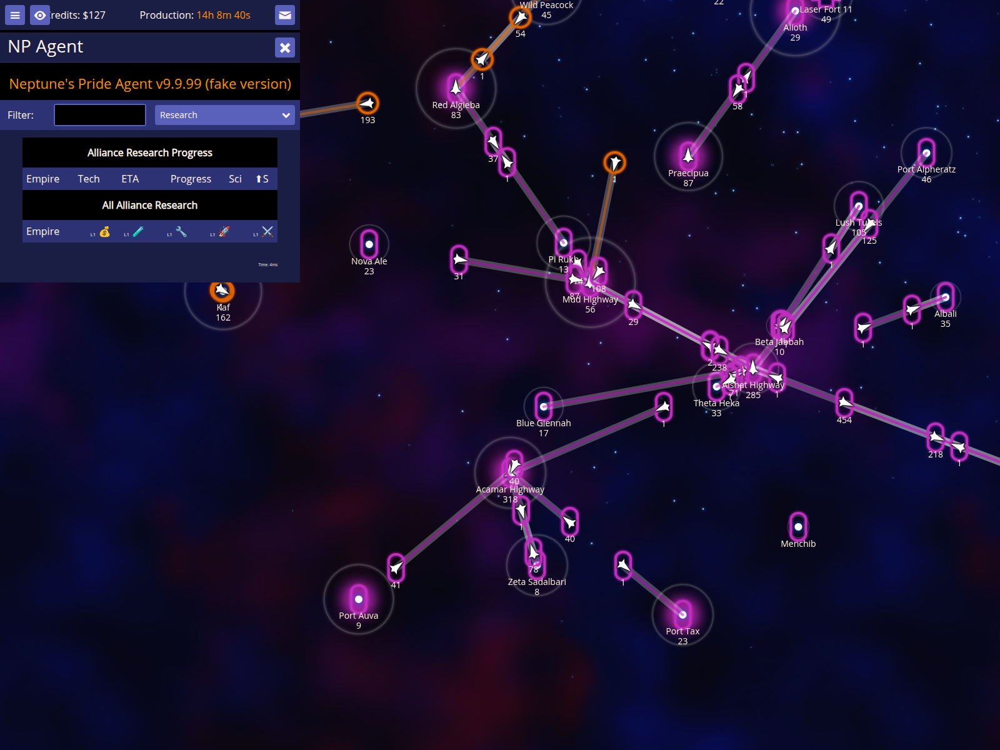
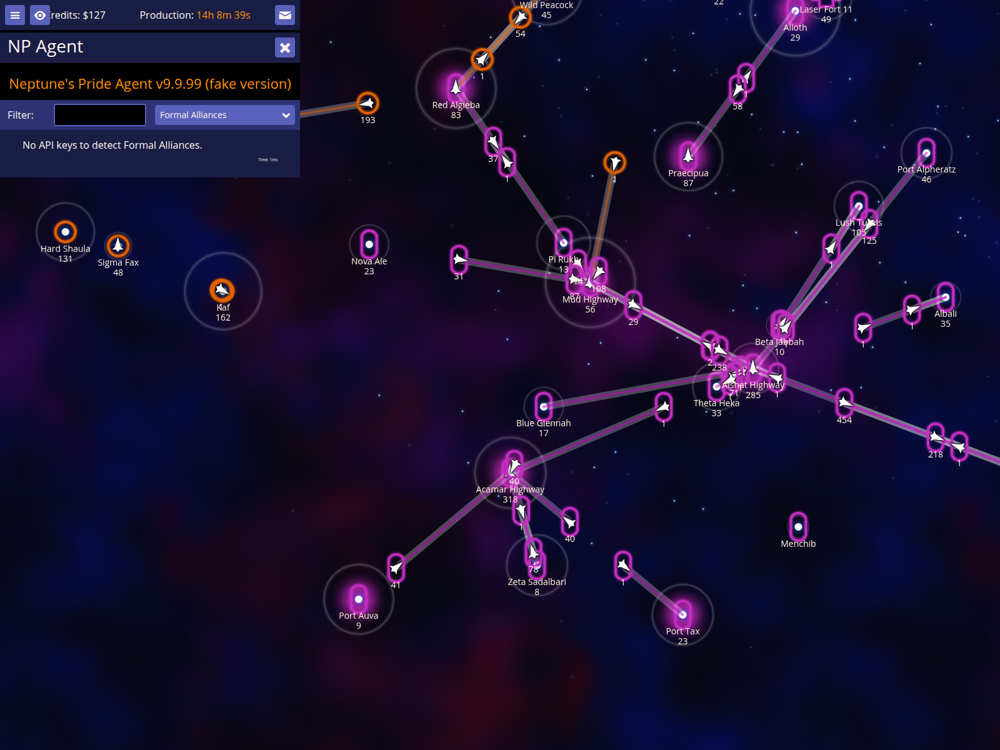

# Alliance Coordination

NPA helps you coordinate with allies by merging their intelligence into your map and providing formal alliance reports.

## Show known API keys report

Press **k** to view all API keys detected in your messages.

### How to use it
- Press **k** while on the map.

### What to expect
- A report appears listing all API keys found in your messages or manually entered.

## Merge an ally's API key

Merge an ally's API key to see their scanned stars, fleets, and technology levels directly on your map.

### How to use it
- Locate an API key in the report or a message.
- Click the merge icon or trigger the merge to integrate the data.

### What to expect
- Your map updates with new intelligence from the ally's perspective.

## Show Alliance Research report

Press **E** to view the research progress of all allies whose API keys you have merged.

### How to use it
- Press **E** while on the map.

### What to expect
- A report appears showing current research, ETAs, and progress for all merged allies.

## Show Formal Alliances report

Press **Ctrl+7** to generate a report of all formal alliances detected in the game.

### How to use it
- Press **Ctrl+7** while on the map.

### What to expect
- A report appears showing which players are in formal alliances based on the merged intelligence.
