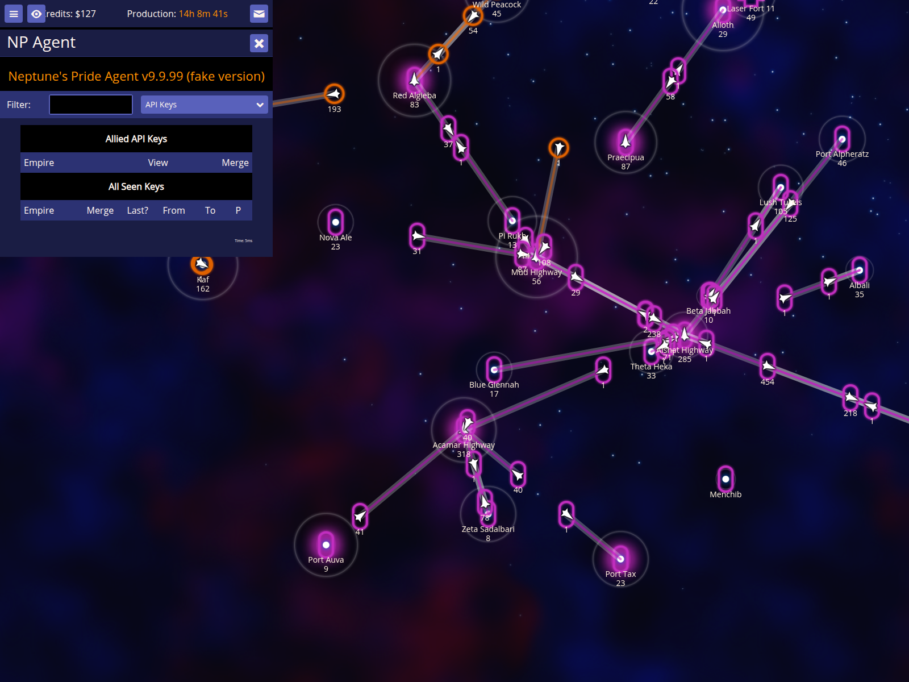
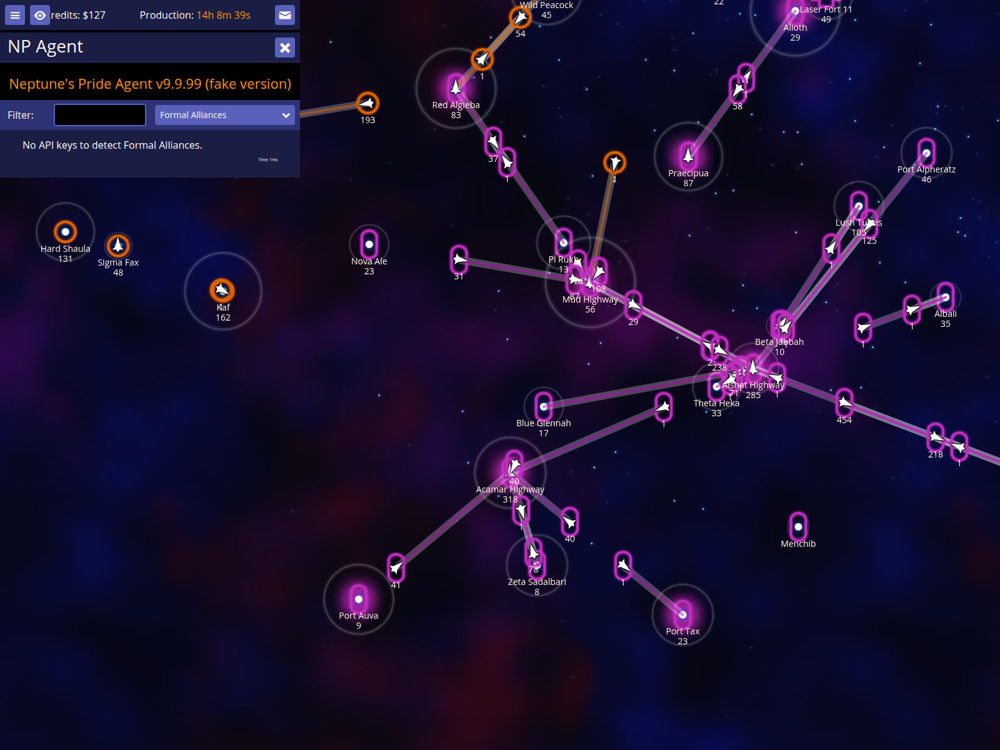

# Alliance Coordination

Demonstrate API key merging and alliance reports

Documentation target: `016`

Companion user documentation: [DOCS.md](./DOCS.md)

## Show known API keys report

### Verifications
- [x] The API keys report is visible

## Merge an ally's API key

### Verifications
- [x] Merging an API key updates the map

## Show Formal Alliances report

### Verifications
- [x] The Formal Alliances report is visible
